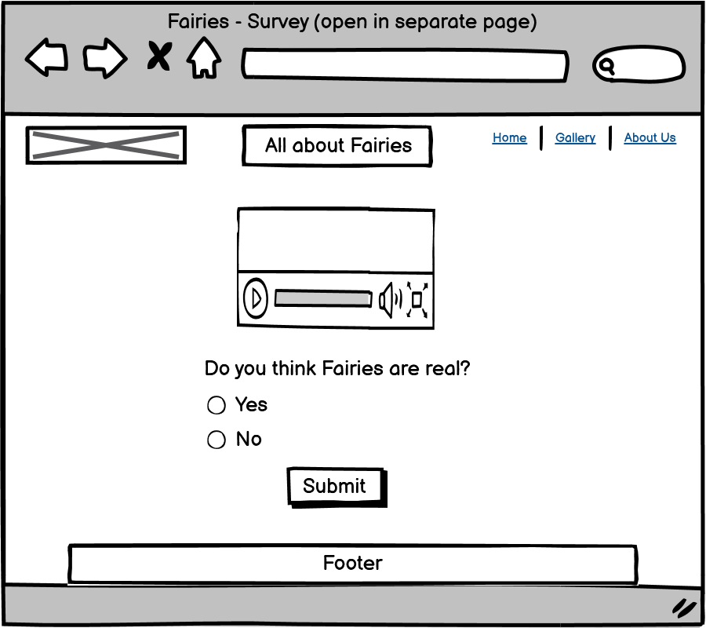
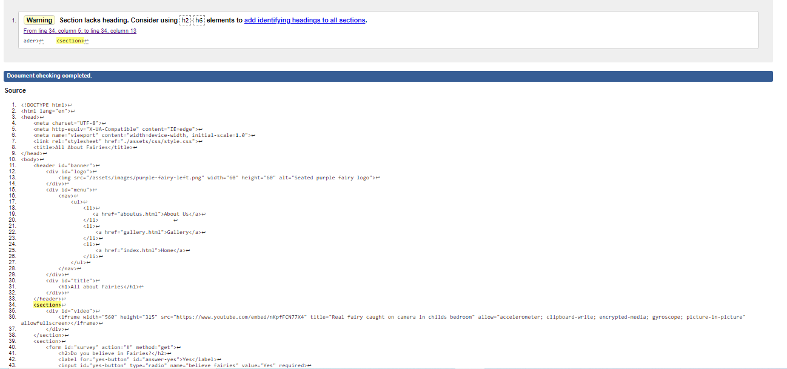

# All about Fairies

/** Add link to website **/

All about Fairies is a site that provides information and interesting facts about Fairies. The site is targeted at users that are interested in fairies and also those that might be sceptical and want to find out more.

## Features

### Existing Features
* Navigation Bar
   * Featured on all four pages is a fully responsive navigation bar that has links to the Home Page, Gallery and About us pages.
   * It is identical on each page and allows the user to move from each page without using the 'back' button on the browser.

 

* What are fairies
   * This section has two eye-catching images and has information explaining what a fairy is.

* History, Interesting facts and Survey
   * The history section provides some interesting information about the history of fairies.
   * The interesting facts section has some fun and strange facts.
   * The survey link takes the user to a survey with a video of a fairy caught on camera, the link opens in a new tab.

   

* Footer
   * The footer section contains links to various social media sites.
   * The links open in a new tab so the user does not have to navigate back to the About Fairies website.

* Gallery
   * The gallery provides the user with some interesting and different pictures of fairies and their habitat.
   * There are a combination of real and fictional images to keep the users guessing as to whether Fairies are real or not.

* About Us
   * This page invites the user to submit comments or suggestions to help improve the website.

* Survey page
   * This page has an interesting video of a supposed fairy caught on camera and asks the user if they believe in fairies. This section helps make the website interactive and provides an element of fun.

## Wireframes

* Home page

* Gallery

* About Us

* Survey

* Home page mobile view

* Gallery mobile view

## Testing
* The W3C Markup Validator and W3C CSS Validator Services were used to validate every page of the project to ensure there were no syntax errors in the project.

    * Screenshot of css validation 

    * Screenshots of html validation
        * Index.html 
        * Gallery.html 
        * AboutUs.html 
        * Survey.html 

* The website was tested continously during the development process as each new piece of code was written. 

### Further Testing
* The website was tested on Google Chrome.
* The website was viewed on a variety of device sizes such as Desktop, Samsung S10 and Samsung tablet, I used the responsive function when inspecting the pages to view various sizes. 
* All links were tested multiple times during the development process to ensure that all pages were linked correctly.
* Family members were asked to view the site and point out any bugs.

### Known Bugs
* There are two errors on the gallery.html and survery.html - I chose not to add headings to these sections as I felt the look of the page did not require any headings.

## Deployment
GitHub Pages
The project was deployed to GitHub Pages using the following steps:

1. Log in to GitHub and locate the GitHub Repository
2. At the top of the Repository (not top of page), locate the "Settings" Button on the menu.
3. Scroll down the Settings page until you locate the "GitHub Pages" Section.
4. Under "Source", click the dropdown called "None" and select "Master Branch".
5. The page will automatically refresh.
6. Scroll back down through the page to locate the now published site link in the "GitHub Pages" section.

## Credits

### Code
* All code was written by the developer, referring occasionally to the relevant modules in HTML and CSS essentials.

### Content
* Content was obtained from the below sources and adapted by the developer.
    * https://en.wikipedia.org/wiki/Fairy
    * https://everyfactever.com/50-facts-about-fairies/
* The colour contrast for the background and title was checked using https://webaim.org/resources/contrastchecker/.

### Media
* Media was obtained from the below sources.
    * All images were obtained from pixabay.com.
    * The video on the survey page was imbedded from Youtube.com.

### Frameworks, Libraries and Programs:
1.  Git
    * Git was used for version control by utilizing the Gitpod terminal to commit to Git and Push to GitHub.
2. Github
    * GitHub is used to store the projects code after being pushed from Git.
3. Google Fonts
    * Google Fonts was used to import Playball and Roboto to the style.css for use throughout the website.
4. Font Awesome
    * Font Awesome was used on the Home page to add icons for design and UX purposes.
5. Balsamiq
    * Balsamiq was used to create the wireframes during the design process.

### Acknowledgements
* My mentor for advice.
* My family for their endless support and feedback.