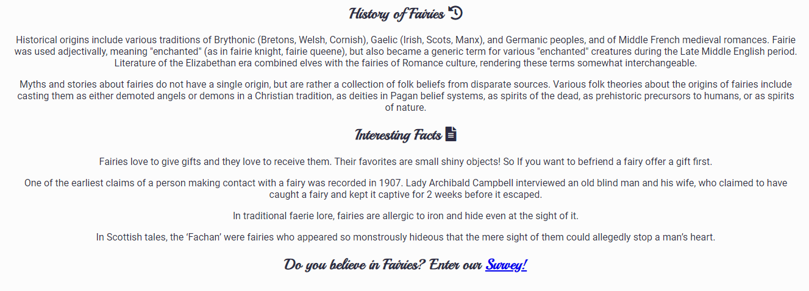

# All about Fairies

## User-Centric Frontend Development Milestone Project

All about Fairies is a site that provides information and interesting facts about Fairies. The site is targeted at users that are interested in fairies and also those that might be sceptical and want to find out more.

# Table of Contents
1. [UX](https://github.com/Michelle3334/play-repo#ux)
    * [Website owner goals](https://github.com/Michelle3334/play-repo#website-owner-business-goals)
    * [User stories](https://github.com/Michelle3334/play-repo#user-stories)
    * [Structure](https://github.com/Michelle3334/play-repo#structure-of-the-website)
    * [Wireframes](https://github.com/Michelle3334/play-repo#wireframes)
    * [Surface](https://github.com/Michelle3334/play-repo#surface)
2. [Features](https://github.com/Michelle3334/play-repo#features)
3. [Technology](https://github.com/Michelle3334/play-repo#technologies-used)
4. [Testing](https://github.com/Michelle3334/play-repo#testing)
    * [Functionality testing](https://github.com/Michelle3334/play-repo#functionality-testing)
    * [Code Validation](https://github.com/Michelle3334/play-repo#code-validation)
    * [Compatibility testing](https://github.com/Michelle3334/play-repo#compatibility-testing)
    * [Performance testing](https://github.com/Michelle3334/play-repo#performance-testing)
    * [User stories testing](https://github.com/Michelle3334/play-repo#user-stories-testing)
    * [Known bugs](https://github.com/Michelle3334/play-repo#known-bugs)
5. [Deployment](https://github.com/Michelle3334/play-repo#deployment)
6. [Credits](https://github.com/Michelle3334/play-repo#credits)
7. [Acknowledgments](https://github.com/Michelle3334/play-repo#acknowledgements)

# UX
## Website owner business goals
The main reason to create this site is to provide a place for the website owner to showcase their knowledge. The website provides interesting facts and beautiful pictures, the website also allows the website owner to interact with the users in order to improve on the content of the website.

## User Stories
### New user goals:
* A first time user, I want to be able to find information about fairies and view images.
* A first time user, I want to navigate the website easily.
* As a first time user, I want to be able to access the site from all device types.
### Returning user goals:
* As a returning user, I would like to provide comments or feedback.
* As a returning user, I want to be able to access the social media links.
### As a business owner:
* I want my visitors to be able to learn how to use my website intuitively and easily.
* I would like provide an element of fun for visitors.
* I would like to build and maintain relationship with potential and current customers.

## Structure of the website
The website is designed to be user-friendy on all device sizes. Links have hover effects to provide interaction with the users.

[Back to Table of Contents](https://github.com/Michelle3334/play-repo#table-of-contents)

## Wireframes
I used Balsamiq to create the wireframes.
* Home page 

* Gallery 

* About Us 

* Survey 

* Home page mobile view 

* Gallery mobile view 

[Back to Table of Contents](https://github.com/Michelle3334/play-repo#table-of-contents)

## Surface
### Colors
The main colors used in this project:
* Background color: #fcfcfc
* Font color: #2c2c44
* Link & hover color: #c164d8
### Fonts
For the main heading elements I used Playball and Roboto is used as the font for all other text. Sans-Serif is used as a backup font.
### Images
I used images from pixabay.com and a video from YouTube. These are credited in credits section.

[Back to Table of Contents](https://github.com/Michelle3334/play-repo#table-of-contents)

# Features
## Existing Features
### Navigation Bar
   * Featured on all four pages is a fully responsive navigation bar that has links to the Home Page, Gallery and About us pages.
   * It is identical on each page and allows the user to move from each page without using the 'back' button on the browser.
     

### What are fairies
   * This section has two eye-catching images and has information explaining what a fairy is.
    

### History, Interesting facts and Survey
   * The history section provides some interesting information about the history of fairies.
   * The interesting facts section has some fun and strange facts.
   * The survey link takes the user to a survey with a video of a fairy caught on camera, the link opens in a new tab.
       

### Footer
   * The footer section contains links to various social media sites.
   * The links open in a new tab so the user does not have to navigate back to the About Fairies website.
    

### Gallery
   * The gallery provides the user with some interesting and different pictures of fairies and their habitat.
   * There are a combination of real and fictional images to keep the users guessing as to whether Fairies are real or not.
    

### About Us
   * This page invites the user to submit comments or suggestions to help improve the website.
    

### Survey page
   * This page has an interesting video of a supposed fairy caught on camera and asks the user if they believe in fairies. This section helps make the website interactive and provides an element of fun.
    

## Features left to implement
* Make the gallery page interactive so when you scroll over the pictures they change slightly (either zoom in or rotate).

[Back to Table of Contents](https://github.com/Michelle3334/play-repo#table-of-contents)

# Technologies Used:
### HTML5
* As a structure language.
### CSS
* As a style language.
### Git
* Git was used for version control by utilizing the Gitpod terminal to commit to Git and Push to GitHub.
### Github
* GitHub is used to store the projects code after being pushed from Git.
### Google Fonts
* Google Fonts was used to import fonts.
### Font Awesome
* Font Awesome was used on the Home page to add icons for design and UX purposes.
### Balsamiq
* Balsamiq was used to create the wireframes during the design process.

[Back to Table of Contents](https://github.com/Michelle3334/play-repo#table-of-contents)

# Testing
## Functionality Testing
* I used Google Chrome developer tools throughout the development process for testing and solving problems with style issues.
* All links were tested multiple times during the development process to ensure that all pages were linked correctly.
* Family members were asked to view the site and point out any bugs.

## Code Validation
* The W3C Markup Validator and W3C CSS Validator Services were used to validate every page of the project to ensure there were no syntax errors in the project.

    * Screenshot of css validation 

    * Screenshots of html validation
        * Index.html 
        * Gallery.html 
        * AboutUs.html 
        * Survey.html 

[Back to Table of Contents](https://github.com/Michelle3334/play-repo#table-of-contents)

## Compatibility Testing
* The website was tested on Google Chrome.
* The website was viewed on a variety of device sizes such as Desktop, Samsung S10 and Samsung tablet, I used the responsive function when inspecting the pages to view various sizes. 

## Performance testing
I ran the Lighthouse tool to check performance of the website. There were two issues that I had to correct. I had omitted the meta name description and the link to the survey page was not good SEO. Screenshots of the final test are presented below:
* Desktop

* Mobile

[Back to Table of Contents](https://github.com/Michelle3334/play-repo#table-of-contents)

## User Stories testing
### As a new user:
* A first time user, I want to be able to find information about fairies and view images.
    * User can see information on the home page and images on the gallery page.
* A first time user, I want to navigate the website easily.
    * The navigation bar allows the user to intuitively and easily move between the various pages. 
* As a first time user, I want to be able to access the site from all device types.
    * The site has been developed to be easily accessible on all device types.
### As a returning user:
* As a returning user, I would like to provide comments or feedback.
    * Users can find a contact form on the About us page.
* As a returning user, I want to be able to access the social media links.
    * Users can access social media using the links in the footer of each page.
### As a business owner:
* I want my visitors to be able to learn how to use my website intuitively and easily.
    * Each site has a navigation bar located at the top of the page.
* I would like provide an element of fun for visitors.
    * An interesting video and survey provides an element of fun.
* I would like to build and maintain relationship with potential and current customers.
    * Users can provide feedback via the contact us form, as well as get in touch via the social media links located in the footer of each page.

## Known Bugs
* There are two errors on the gallery.html and survery.html - I chose not to add headings to these sections as I felt the look of the page did not require any headings.

[Back to Table of Contents](https://github.com/Michelle3334/play-repo#table-of-contents)

# Deployment
The project was deployed to GitHub Pages using the following steps, I used Gitpod as a development environment where I commited all changes to git version control system. I used push command in Gitpod to save changes into GitHub:

1. Log in to GitHub and locate the GitHub Repository.
2. At the top of the Repository, click on the "Settings" Button on the menu.
3. Scroll down the Settings page until you locate the "Pages" Section.
4. Under "Source", click the dropdown called "None" and select "Master Branch" and click on save.
5. The page will automatically refresh.
6. The now published site link shows at the top of the page.

The live link can be found here: https://michelle3334.github.io/portfolio-one/

To run locally:

1. Log in to GitHub and click on repository to download.
2. Select Code and click Download the ZIP file.
3. After download you can extract the file and use it in your local environment.
4. Alternatively you can Clone or Fork this repository into your github account.

[Back to Table of Contents](https://github.com/Michelle3334/play-repo#table-of-contents)

# Credits
## Code
* All code was written by the developer, referring occasionally to the relevant modules in HTML and CSS essentials.

## Content
* Content was obtained from the below sources and adapted by the developer.
    * https://en.wikipedia.org/wiki/Fairy
    * https://everyfactever.com/50-facts-about-fairies/
* The colour contrast for the background and title was checked using https://webaim.org/resources/contrastchecker/.

## Media
* Media was obtained from the below sources.
    * All images were obtained from pixabay.com.
    * The video on the survey page was imbedded from Youtube.com.

## Acknowledgements
* My mentor for advice and feedback.
* My family for their endless support and feedback.

[Back to Table of Contents](https://github.com/Michelle3334/play-repo#table-of-contents)